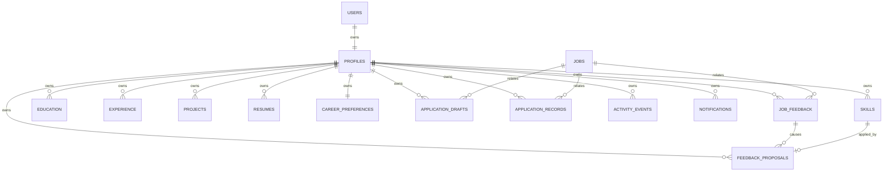

# JobPilot AI — Database Schema

## Current implemented schema

Alembic head is `0014_create_feedback_proposals`. UUID IDs are stable primary keys. Timestamps are timezone-aware server defaults unless noted. Fields are source-of-truth unless identified as snapshot/derived. Jobs are shared; every private row is reached through its owning `profile` and authenticated `user`.

| Table | Columns (type; nullability) | Keys, ownership, lifecycle |
|---|---|---|
| `users` | id UUID; email varchar(320); password_hash varchar(255); is_active bool; created_at/updated_at timestamptz — all required | PK id; unique/index email. Authentication source-of-truth. |
| `profiles` | id UUID; user_id UUID; full_name, phone, location, headline nullable strings; summary nullable text; timestamps | PK; unique FK user→users. Private root; cascade-dependent profile data. |
| `skills` | id, profile_id UUID; name varchar(150), proficiency varchar(20) required; category nullable; timestamps | PK; FK profile cascade; profile index. User-provided or confirmed-learning data. |
| `education` | id/profile_id UUID; institution, start_date required; degree, field_of_study, end_date, description nullable; timestamps | FK profile cascade/index. |
| `experience` | id/profile_id UUID; company, job_title, start_date required; location/end_date/description nullable; timestamps | FK profile cascade/index. |
| `projects` | id/profile_id UUID; name, start_date required; description/url/end_date nullable; timestamps | FK profile cascade/index. |
| `resumes` | id/profile_id UUID; original_filename, stored_filename, storage_key, mime_type, file_size required; review_status required; review_data nullable JSON; timestamps | FK profile cascade; unique `storage_key`; profile index. File metadata/source and reviewed parsed snapshot. |
| `career_preferences` | id/profile_id UUID; 12 required JSON list fields; relocation_preference required; salary_min/max, available_from nullable; timestamps | unique FK profile cascade. User/confirmed-learning source-of-truth. |
| `jobs` | id; title/company/description/source/dedupe_key required; location/employment_type/external_job_id/external_url/posted_at nullable; timestamps | Shared. unique dedupe_key; source/external-job indexes. External source-of-truth normalized copy. |
| `application_drafts` | id/profile_id/job_id UUID; resume_id nullable; status/revision/content/profile_snapshot/job_snapshot required; approved_revision nullable; approval_confirmed required; timestamps | FKs profile/job cascade, resume set-null; profile/job and profile/status indexes. Snapshots preserve draft grounding/version. |
| `application_records` | id/profile_id/job_id UUID; draft_id nullable; status, job_snapshot required; notes, dates, draft_revision nullable; timestamps | FKs profile/job cascade, draft set-null; unique profile/job; owner tracking record; job snapshot retained. |
| `activity_events` | id/profile_id; event_type/state/message/details required; job/draft/application_record nullable; created_at | Profile FK cascade; related FKs set-null; profile/time index. Append-oriented audit/activity record. |
| `notifications` | id/profile_id; type/severity/message/details/is_read required; job/draft/record nullable; created_at/read_at | Profile FK cascade; related FKs set-null; profile/read/time index. Private in-app notification. |
| `job_feedback` | id/profile_id/job_id; feedback_type/source required; note nullable; timestamps | Profile/job cascade; unique profile/job/feedback_type; profile/time and job indexes. User statement. |
| `feedback_proposals` | id/profile_id/feedback_id required; target_type/status/proposed_value/previous_value required; target_field/applied_skill_id/timestamps nullable | Profile/feedback cascade; skill set-null; profile and feedback indexes. Confirmation-gated learning/audit snapshot. |

Status/check constraints are mostly application/service validation rather than database `CHECK` constraints. This is an important current-schema fact, not an implied guarantee. `updated_at` is maintained by ORM update configuration; verify DB-trigger behavior before non-ORM writers are introduced.

## Migration history

`0001` users; `0002` profiles; `0003` skills/education/experience/projects; `0004` resumes; `0005` resume review; `0006` jobs; `0007` career preferences; `0008` drafts; `0009` draft approval; `0010` records; `0011` activity; `0012` notifications; `0013` feedback; `0014` feedback proposals.

## Planned schema

No future table is approved. Derived matching/ranking results are intentionally not persisted. **UNDEFINED — REQUIRES PRODUCT DECISION:** agent-run state/audit persistence, external-action evidence, source synchronization metadata, notification expiry, data deletion records, and any future migration. They require a separate approved change with owner, lifecycle, relationships, and migration plan.
