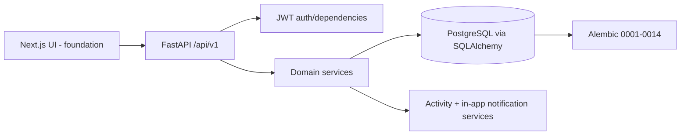

# JobPilot AI — Technical Requirements Document

## Architecture

The current system is a Next.js frontend foundation and a FastAPI backend under `/api/v1`, backed by SQLAlchemy/Alembic PostgreSQL design. Backend modules are `auth`, `profile`, `resume`, `job`, `application`, `activity`, `notification`, and `feedback`. API handlers authenticate, translate expected domain errors, and call services; services own workflow rules; repositories encapsulate profile/job data access where present; models map persisted entities. `frontend/app/page.tsx` currently renders only a foundation message.

## Boundaries and deterministic controls

The API/service/database layer deterministically enforces permissions, authenticated profile resolution, ownership, schema validation, application states, approval/revision binding, durable writes, and activity records. Shared jobs are global; all profile, resume, draft, record, feedback, proposal, activity, and notification lookup is owner-scoped. The local ingestion endpoint additionally checks configured admin email allow-list.

No implemented LLM client, prompt registry, agent worker, scheduler, or external submission tool exists. `AI_PROVIDER` and `AI_API_KEY` are configuration placeholders only. Future AI must return schema-validated proposals and use service-owned tools; it may never connect directly to the database or bypass the above controls. External job content is untrusted data, not instructions.

## Workflow design

Job pipeline: authorized source adapter/local record → normalize/deduplicate → shared `jobs` persistence → authenticated search → deterministic matching → deterministic ranking → explanations. Matching and ranking are read-time derived outputs, not persisted match rows. Feedback is separate; only confirmed profile/preference changes can naturally influence future ranking.

Application pipeline: grounded profile/job snapshot → revisioned draft → owner review/edit → explicit approval of current revision → optional private manual record. There is no submission service. Idempotent operations include resume approval, draft approval, feedback update by feedback-type/job/profile, and repeated proposal confirm/reject/revoke in their terminal valid state.

## Errors, retries, logging, testing, deployment

Expected domain errors become HTTP errors; unsafe/invalid input is rejected rather than guessed. No retry policy or job queue is implemented: **UNDEFINED — REQUIRES PRODUCT DECISION** before network integrations exist. Activity and notifications provide user-visible workflow traces; structured operational logging, retention, correlation IDs, and monitoring are **UNDEFINED**. Tests are pytest endpoint/service regressions; the existing suite covers health, database, auth, profile, resume, job/match, application, and activity/feedback. Docker Compose/Dockerfiles exist; deployment topology, backups, production secrets, CORS, and CI/CD remain **UNDEFINED**.

## Configuration and security

Environment-backed settings are `APP_ENV`, `LOG_LEVEL`, `DATABASE_URL`, `REDIS_URL`, `AI_PROVIDER`, `AI_API_KEY`, `AUTH_SECRET`, `AUTH_TOKEN_EXPIRE_MINUTES`, `RESUME_STORAGE_PATH`, and `JOB_INGESTION_ADMIN_EMAILS`. Secrets are not logged or committed. JWT credentials gate private routes. URL/file validation is module-specific; production malware scanning, rate limits, CSRF approach, and data-erasure implementation are **UNDEFINED — REQUIRES PRODUCT DECISION**.
